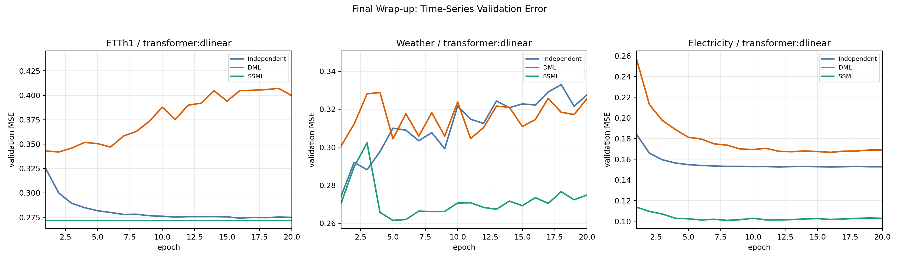
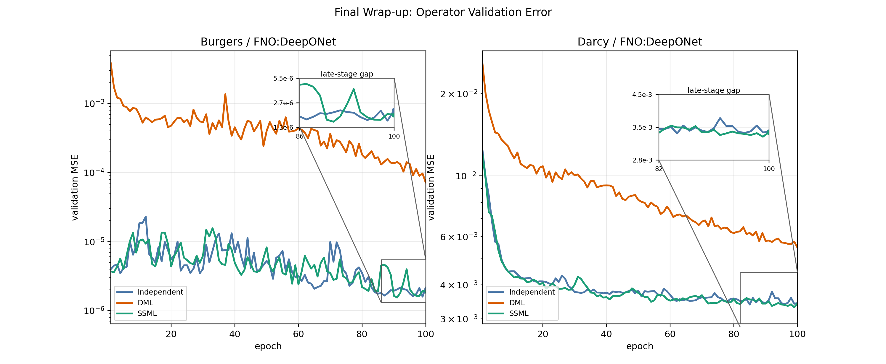
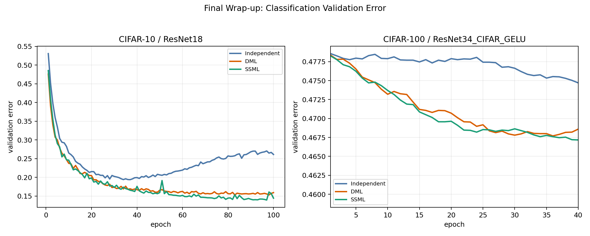

# Final Wrap-up

## 1. 핵심 메시지

이번 논문의 메인 메시지는 다음과 같이 정리한다.

> SSML은 서로 다른 오류를 내는 두 모델이, 상대가 더 잘하는 부분만 선택적으로 가르치도록 해서 성능을 끌어올리는 방법이다.

논문에서는 모든 task를 다 같은 방식으로 밀기보다, 공통 원리는 유지하되 task별로 selection granularity와 stabilization 장치를 약간씩 바꿔 적용했다는 점을 분명히 적는다.

현재 메인 스토리는 다음 축으로 가져간다.

1. `Time-series`: Weather, Electricity, ETTh1
2. `Operator learning`: Burgers, Darcy
3. `Classification`: CIFAR-10, CIFAR-100 follow-up (`cifarstem`)

---

## 2. 메인 Figure 구성

### 2.1 Time-series figure

- 사용할 그림: `final_wrapup_time_series.png`
- 패널 구성:
  1. `ETTh1`
  2. `Weather`
  3. `Electricity`
- 표시 범위:
  - **모든 패널을 epoch 20까지만 잘라서 사용**
- ETTh1 표기:
  - **best baseline 하나만 남기고, 이름은 그냥 `Independent`로 표기**
- 목적:
  - 초반 학습 구간에서 SSML이 어떤 방향으로 baseline과 벌어지거나 붙는지 비교
  - Electricity의 경우 후반 late drift가 있으므로, 초반 20 epoch만 따로 보는 그림이 필요

### 2.2 Operator learning figure

- 사용할 그림: `final_wrapup_operator.png`
- 패널 구성:
  1. `Burgers`
  2. `Darcy`
- 표시 범위:
  - **두 패널 모두 epoch 100까지 잘라서 사용**
- 목적:
  - tail 전체를 다 보여주기보다, 성능이 갈리는 구간을 더 보기 좋게 정리
  - 두 task 모두 log-scale MSE 유지
  - 본 패널은 `1-100 epoch`, inset은 그 안에서 separation이 생기는 late-stage 구간만 확대

### 2.3 Classification figure

- 사용할 그림: `final_wrapup_classification.png`
- 패널 구성:
  1. `CIFAR-10`: 기존 메인 curve 사용
  2. `CIFAR-100`: **제일 아래 CIFAR-100 only figure의 오른쪽 패널에 해당하는 `cifarstem_followup_v1` 결과 사용**
- 표시 범위:
  - `CIFAR-10`: 기존 범위 유지
  - `CIFAR-100`: **epoch 40까지만 사용**
- 목적:
  - CIFAR-10은 clean win을 보여주고,
  - CIFAR-100은 strict128 원판보다 논문 메시지에 더 맞는 follow-up backbone pivot 결과를 보조적으로 제시

---

## 3. 실험별 세팅 정리

### 3.1 Time-series

| Dataset | Pair | Main setting | Seeds / Epochs | 비교 기준 | 비고 |
| --- | --- | --- | --- | --- | --- |
| Weather | `transformer x dlinear` | `instruction_matrix_v1` | `3 seeds / 60 epochs` | `Independent`, `DML`, `SSML` | clean win. plot은 epoch 20까지만 사용 |
| Electricity | `transformer x dlinear` | `corrective_v1 / corr_gate64_l15_sp5e4` | `3 seeds / 60 epochs` | strongest baseline은 `dlinear independent` | official reading은 final epoch가 아니라 best checkpoint 기준 |
| ETTh1 | `transformer x dlinear` | `teacher_ft_pairdeploy_reeval_20260405_v1 / tft_tail10_reg15_l010_lr2e4` | `SSML 3 seeds`, baseline rerun은 `6 seeds / 80 epochs` | figure에는 strongest baseline 하나를 `Independent`로 표기하고 `DML`, `SSML`과 비교 | clean win이 아니라 deployed `best_branch` diagnostic으로 해석 |

### 3.2 Operator learning

| Dataset | Pair | Main setting | Seeds / Epochs | 비교 기준 | 비고 |
| --- | --- | --- | --- | --- | --- |
| Burgers | `FNO x DeepONet` | `operator_burgers_polish_aggressive_v4 / cos_relay_full_l0012_s20_70_40_sample_lr4e4` | `3 seeds / 180 epochs` | same-campaign independent `ctrl_cos`, DML reference는 `followup_v1` | current strongest Burgers result |
| Darcy | `FNO x DeepONet` | `operator_ssml_tuned_v1` | `3 seeds / 150 epochs` | same-track `Independent`, `DML`, `SSML` | 가장 깔끔한 operator win |

### 3.3 Classification

| Dataset | Pair | Main setting | Seeds / Epochs | 비교 기준 | 비고 |
| --- | --- | --- | --- | --- | --- |
| CIFAR-10 | `resnet18 x resnet18` | `instruction_matrix_v1 / classification_homo` | `3 seeds / 100 epochs` | DML은 `classification_cifar10_homo_dml_long_v1` | long rerun 후에도 SSML이 유지됨 |
| CIFAR-100 | `resnet34_cifar_gelu x resnet34_cifar_gelu` | `classification_cifar100_cifarstem_followup_v1 / oxtra42_cifarstem_v1` | `matched 3 seeds / 100 epochs` | controls는 `cifarstem_independent_v1`, `cifarstem_dml_v1` | wrap-up figure는 epoch 40까지만 사용 |

### 3.4 대표 결과 요약 (`mean ± std`)

아래 표의 `±`는 seed 간 sample std를 뜻한다. 회귀 task는 `best val MSE` 기준이고, classification은 `best val acc1 (%)` 기준이다.

| Task | Dataset | Independent | DML | SSML | 비고 |
| --- | --- | --- | --- | --- | --- |
| Time-series | Weather | `0.2728 ± 0.0084` | `0.2817 ± 0.0025` | `0.2613 ± 0.0016` | `3 seeds`, lower is better |
| Time-series | Electricity | `0.15239 ± 0.00006` | `0.16403 ± 0.00072` | `0.10014 ± 0.00166` | `best checkpoint` 기준 |
| Time-series | ETTh1 | `0.27203 ± 0.00045` | `0.32767 ± 0.00845` | `0.27184 ± 0.00050` | `Independent/DML = 6 seeds`, `SSML = 3 seeds` |
| Operator | Burgers | `9.85e-07 ± 2.69e-07` | `9.32e-06 ± 2.08e-06` | `9.65e-07 ± 2.53e-07` | same-campaign independent 대비 소폭 우세 |
| Operator | Darcy | `0.003200 ± 0.000530` | `0.004758 ± 0.000595` | `0.003148 ± 0.000534` | 가장 clean한 operator row |
| Classification | CIFAR-10 | `80.92 ± 0.45` | `84.97 ± 0.26` | `86.42 ± 0.06` | `acc1 (%)`, higher is better |
| Classification | CIFAR-100 | `54.72 ± 5.70` | `55.03 ± 5.92` | `55.07 ± 6.02` | `cifarstem` follow-up row |

---

## 4. Task별 변형 포인트

이 절은 논문 본문에서는 세 task를 하나의 관점으로 묶어 설명하고, dataset별 세부 해석은 appendix 성격의 상세 메모로 분리하는 방식이 가장 적절하다. 핵심은 세 task가 서로 다른 문제처럼 보이더라도, 실제로는 **동일한 SSML 원리를 서로 다른 selection unit 위에 올린 경우**라는 점이다. 두 모델을 `f_i`, `f_j`라고 하고, selection의 기본 단위를 `z`라고 두면 SSML의 공통 형태는 다음과 같다.

$$
\ell_i^{\mathrm{sup}}(z)=\mathcal L_{\mathrm{task}}(f_i(z), y(z)),
\qquad
g_{i\leftarrow j}(z)=\mathbf 1\!\left[\ell_j^{\mathrm{sup}}(z)+m<\ell_i^{\mathrm{sup}}(z)\right],
$$

$$
\mathcal L_i
=
\mathbb E_z\!\left[\ell_i^{\mathrm{sup}}(z)\right]
+\lambda\,\mathbb E_z\!\left[g_{i\leftarrow j}(z)\,\ell^{\mathrm{imit}}\!\left(f_i(z),\operatorname{sg}(f_j(z))\right)\right].
$$

여기서 supervised term이 항상 유지된다는 점이 중요하다. 즉, SSML은 peer output으로 ground truth를 대체하는 방법이 아니라, **peer가 더 잘하는 단위에서만 추가적인 imitation signal을 더하는 방법**이다. 이 관점에서 보면 time-series forecasting, operator learning, image classification은 서로 다른 task라기보다, 동일한 식 위에서 `z`만 다르게 정의한 경우라고 정리할 수 있다.

$$
z=
\begin{cases}
(n,h), & \text{time-series forecasting}\\
(n,q), & \text{operator learning}\\
n, & \text{image classification}
\end{cases}
$$

여기서 `n`은 sample index, `h`는 forecast horizon, `q \in \Omega`는 spatial location을 뜻한다. 이 정의에 따라 supervised loss는 각 task에 맞게 바뀌지만 구조는 동일하다. Forecasting에서는 $\ell_i^{\mathrm{sup}}(n,h)=\left\|\hat y_i^{(n)}(h)-y^{(n)}(h)\right\|_2^2$, operator learning에서는 $\ell_i^{\mathrm{sup}}(n,q)=\left\|\hat u_i^{(n)}(q)-u^{(n)}(q)\right\|_2^2$, classification에서는 $\ell_i^{\mathrm{sup}}(n)=\mathrm{CE}\!\left(p_i(x_n), y_n\right)$로 쓸 수 있다. 따라서 세 domain을 하나로 묶는 가장 좋은 설명은 다음과 같다. **SSML은 prediction 구조가 sequence이든, field이든, class probability이든 상관없이, target을 구성하는 더 작은 단위에서 peer superiority를 판정하고 그 위치에만 imitation을 여는 일반 원리**라는 것이다.

이때 task별 차이는 원리 자체가 아니라 selection unit의 성격에서 생긴다. Forecasting에서는 horizon마다 우위가 달라지므로 gate가 시간축을 따라 희소하게 열려야 하고, operator learning에서는 공간 해상도에 따라 gate의 granularity가 달라진다. Classification에서는 selection unit이 sample로 가장 단순하지만, homogeneous setting에서는 gate가 지나치게 조밀해지거나 특정 class에 편중될 수 있으므로 filtering과 balancing이 더 중요해진다. 결국 세 task는 모두 $\text{same supervised backbone}+\text{peer-better mask}+\text{task-specific control of mask density}$라는 공통 구조로 읽을 수 있다. 논문 본문에서는 이 unified view를 먼저 제시한 뒤, task별 디테일은 appendix 성격의 상세 메모로 분리하는 편이 가장 자연스럽다.

### 4.1 Appendix-style Detailed Notes

아래 내용은 본문보다는 appendix나 supplementary note 쪽에 가까운 상세 메모로 두는 편이 좋다. 본문에서는 unified formulation과 대표 결과만 남기고, 여기서는 dataset별로 어떤 세부 변형이 실제로 중요했는지 bullet point로 정리한다.

#### Time-series forecasting

- 공통 구조:
  - selection unit은 `z=(n,h)`이며, 각 horizon `h`에서 peer가 더 작은 error를 보일 때만 imitation을 연다.
  - forecasting에서는 gate density가 높아지면 후반 drift가 커지므로, `\lambda_t` schedule과 activation sparsity가 사실상 방법의 일부처럼 작동한다.
- `Weather`:
  - 가장 canonical한 forecasting win이다.
  - 비교적 단순한 horizon-wise selective gate만으로 `Independent`와 `DML`을 모두 넘는다.
  - task-specific stabilization을 많이 추가하지 않아도 hard selective imitation이 충분히 작동한 경우로 해석할 수 있다.
- `Electricity`:
  - best checkpoint 기준으로는 매우 강한 개선이 나오지만, 후반 epoch에서 validation curve가 다시 상승하는 late drift가 반복된다.
  - strongest row인 `corrective_v1 / corr_gate64_l15_sp5e4`는 “peer imitation”이라기보다 취약 horizon만 보정하는 corrective guidance에 가깝다.
  - 후속 `late handoff`, `budget cap`, `sparser guidance`는 모두 활성 imitation 비율 $\rho_t=\frac{1}{NH}\sum_{n,h} g_{i\leftarrow j}^{(t)}(n,h)$를 낮추고 drift를 줄이기 위한 변형으로 읽을 수 있다.
- `ETTh1`:
  - 기본 horizon-wise gate만으로는 충분하지 않아 `teacher fine-tuning`, `reweight`, `handoff`, `router`, `pair-deployed reevaluation`이 추가되었다.
  - 최종 best 값은 pure student improvement라기보다 stronger branch selection의 영향이 크다.
  - 따라서 ETTh1는 clean win이 아니라, selective teaching과 selective deployment를 구분해야 함을 보여주는 diagnostic case로 두는 것이 적절하다.

#### Operator learning

- 공통 구조:
  - selection unit은 `z=(n,q)`이며, spatial location `q` 혹은 spatial block에서 peer superiority를 판정한다.
  - `sample`, `coarse`, `element` 변형은 서로 다른 방법이라기보다, 공간 해상도를 다르게 잡은 동일한 SSML의 구현으로 보는 편이 맞다.
- `Burgers`:
  - 메인 스토리는 from-scratch co-training보다 strong baseline 위에서 selective peer polishing을 수행했다는 점에 있다.
  - `operator_burgers_polish_aggressive_v4`에서 cosine decay 기반 polish regime이 도입되며 성능이 크게 개선되었다.
  - `relay`, `coarse`, `sample`, `element`를 비교한 결과 best는 `cos_relay_full_l0012_s20_70_40_sample_lr4e4`였다.
  - 해석상 핵심은 “peer superiority를 무조건 더 미세하게 보는 것”보다, 충분히 informative한 공간 단위에서 안정적으로 여는 것이 더 중요했다는 점이다.
- `Darcy`:
  - canonical `operator_ssml_tuned_v1` setting 자체에서 이미 clean한 ordering이 나온다.
  - 별도의 복잡한 polish narrative 없이도 field-level selective correction이 자연스럽게 작동한 사례로 설명할 수 있다.
  - 이후 `student lift`, `relay` 계열은 메인 claim이라기보다 weak-model rescue에 가까운 follow-up으로 두는 편이 적절하다.

#### Image classification

- 공통 구조:
  - selection unit은 `z=n`인 sample-wise gate다.
  - 다만 homogeneous image classification에서는 gate가 너무 쉽게 조밀해지거나 특정 class에 편중될 수 있어, filtering과 balancing이 중요해진다.
  - 개념적으로는
    $$
    \tilde g_{i\leftarrow j}(n)
    =
    g_{i\leftarrow j}(n)\cdot
    \mathbf 1[n\in \mathcal T_k]\cdot
    \mathbf 1[n\in \mathcal D]\cdot
    w_c(n)
    $$
    와 같이 top-k, disagreement filter, class balancing을 곱해준 형태로 이해할 수 있다.
- `CIFAR-10`:
  - classification domain에서 가장 직관적인 positive example이다.
  - 복잡한 filtering 없이도 sample-wise hard selective imitation만으로 `Independent`와 `DML`을 모두 넘는다.
  - long DML rerun 이후에도 ordering이 유지되므로 main paper의 clean classification row로 쓰기 좋다.
- `CIFAR-100`:
  - sample-wise gate만으로는 부족한 hard homogeneous setting이다.
  - strict128 원판과 후속에서 `augfilter`, `top-k`, `disagreement-aware filtering`, `scheduled complement`, `best checkpoint pool` 등이 모두 gate density와 class imbalance를 제어하기 위한 장치로 들어갔다.
  - aggressive follow-up 일부는 `lr / weight_decay` 전달 버그가 확인되었으므로 diagnostic으로만 유지하는 것이 맞다.
  - `cifarstem_followup_v1`은 strict128 원판과 동일한 SSML 논리를 backbone bottleneck이 덜한 setting에서 다시 검증한 구조적 follow-up으로 설명하는 것이 가장 자연스럽다.

---

## 5. 논문 본문 구조 제안

### 5.1 Main paper

1. `Introduction`
   - 왜 broad mutual learning이 위험한지
   - 왜 selective imitation이 필요한지
2. `Method`
   - SSML core rule
   - classification / time-series / operator에서 selection granularity만 달라진다는 점
3. `Experimental setup`
   - dataset, model pair, seed 수, epoch budget
   - independent / DML / SSML 비교 규칙
4. `Main results`
   - CIFAR-10
   - Weather
   - Electricity
   - Burgers
   - Darcy
5. `Failure and boundary cases`
   - ETTh1
   - CIFAR-100 strict128 original protocol
6. `Discussion`
   - selective imitation이 잘 되는 조건
   - dense imitation이나 branch selection의 위험
7. `Conclusion`

### 5.2 Appendix / follow-up

1. CIFAR-100 `strict128` historical row
2. CIFAR-100 `cifarstem_followup_v1`
3. Electricity late-drift audit
4. ETTh1 pair-deployed interpretation

---

## 6. 문장 레벨에서 꼭 지킬 점

- `ETTh1`는 **win이라고 쓰지 않는다**
- `Electricity`는 **best checkpoint 기준**이라고 명시한다
- `Burgers`는 **same-campaign independent와 차이는 작지만, 현재 strongest result**라는 식으로 쓴다
- `CIFAR-100 strict128`는 **independent는 이기지만 DML은 못 넘었다**고 정직하게 쓴다
- `CIFAR-100 cifarstem`은 **follow-up evidence**로 두되, 메인으로 올릴지 appendix로 둘지는 마지막에 결정한다

---

## 7. 바로 다음 작업

1. figure caption 초안 쓰기
2. main result table 정리
3. task별 setting 문단을 LaTeX 문체로 다듬기
4. failure case 문단을 별도로 정리하기
