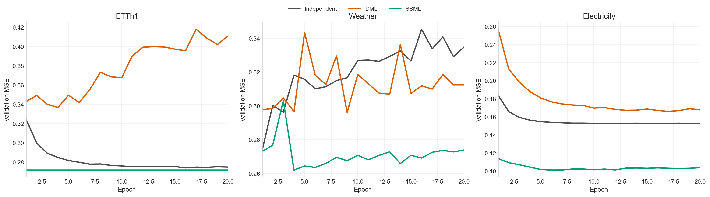
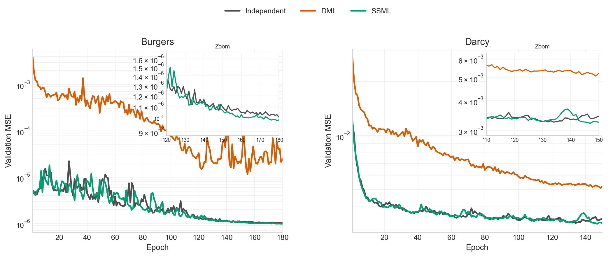
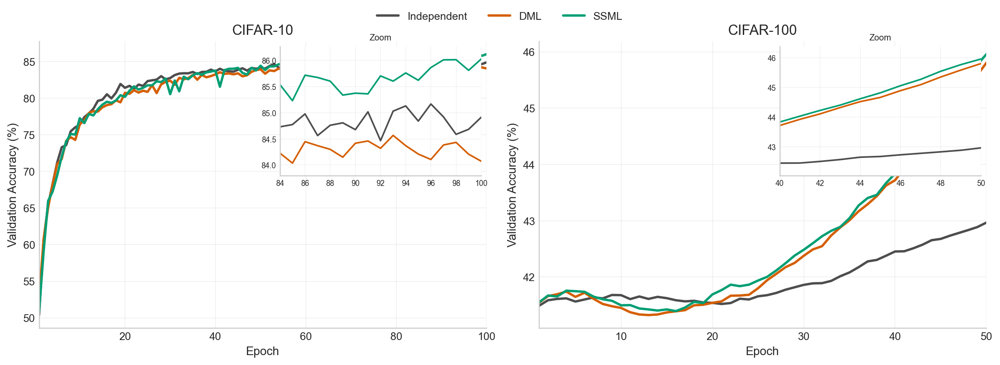

# Results Summary

## Scope

This document is generated from files inside this `final_code/` directory only.

- Source run directory: `results/`
- Source notebook: `notebooks/04_final_wrapup.ipynb`
- Notebook table artifact: `artifacts/tables/final_wrapup_summary.md`
- Notebook figure artifacts: `artifacts/figures/`
- Dispatch record: `results/_dispatch/20260419_175818/`

The table and figures below are notebook-exported artifacts from `final_code/`.

## Run Record

Dispatch run: `20260419_175818`

| Target | Host | GPU | Experiments |
| --- | --- | --- | --- |
| `local_gpu1` | `localhost` | `1` | `cifar100_cifarstem` |
| `worker2_gpu0` | `worker2` | `0` | `etth1`, `electricity` |
| `worker1_gpu0` | `worker1` | `0` | `weather`, `darcy` |
| `worker1_gpu1` | `worker1` | `1` | `burgers`, `cifar10` |

Run-complete status from `results/_dispatch/20260419_175818/events.tsv`: `0` at `2026-04-20T00:24:35+09:00`.

## Final Table

Generated by `notebooks/04_final_wrapup.ipynb`; artifact: `artifacts/tables/final_wrapup_summary.md`

| Task | Dataset | Note | Independent | DML | SSML |
| --- | --- | --- | --- | --- | --- |
| Time-series | ETTh1 | Independent/DML 6 seeds, SSML 3 seeds, best_branch interpretation | 0.2720 ± 0.0004 | 0.3210 ± 0.0086 | 0.2718 ± 0.0005 |
| Time-series | Weather | 3 seeds, lower is better | 0.2735 ± 0.0086 | 0.2841 ± 0.0018 | 0.2602 ± 0.0030 |
| Time-series | Electricity | best checkpoint reading | 0.1524 ± 0.0001 | 0.1644 ± 0.0011 | 0.1005 ± 0.0009 |
| Operator | Burgers | same-campaign independent vs SSML | 1.01e-06 ± 3.28e-07 | 8.91e-06 ± 2.15e-06 | 9.72e-07 ± 2.97e-07 |
| Operator | Darcy | same-track independent, DML, SSML | 0.003230 ± 0.000658 | 0.005073 ± 0.000902 | 0.003212 ± 0.000645 |
| Classification | CIFAR-10 | acc1 (%), higher is better | 85.34 ± 0.18 | 84.82 ± 0.07 | 86.18 ± 0.09 |
| Classification | CIFAR-100 | cifarstem follow-up row | 47.38 ± 1.06 | 53.03 ± 1.57 | 53.13 ± 1.56 |

CSV artifact: `artifacts/tables/final_wrapup_summary.csv`

## 4. Task별 변형 포인트

이 절은 논문 본문에서는 세 task를 하나의 관점으로 묶어 설명하고, dataset별 세부 해석은 appendix 성격의 상세 메모로 분리하는 방식이 가장 적절하다. 핵심은 세 task가 서로 다른 문제처럼 보이더라도, 실제로는 **동일한 SSML 원리를 서로 다른 selection unit 위에 올린 경우**라는 점이다. 두 모델을 `f_i`, `f_j`라고 하고, selection의 기본 단위를 `z`라고 두면 SSML의 공통 형태는 다음과 같다.

$$
\ell_i^{\mathrm{sup}}(z)=\mathcal L_{\mathrm{task}}(f_i(z), y(z)),
\qquad
g_{i\leftarrow j}(z)=\mathbf 1\!\left[\ell_j^{\mathrm{sup}}(z)+m<\ell_i^{\mathrm{sup}}(z)\right],
$$

$$
\mathcal L_i
=
\mathbb E_z\!\left[\ell_i^{\mathrm{sup}}(z)\right]
+\lambda\,\mathbb E_z\!\left[g_{i\leftarrow j}(z)\,\ell^{\mathrm{imit}}\!\left(f_i(z),\operatorname{sg}(f_j(z))\right)\right].
$$

여기서 supervised term이 항상 유지된다는 점이 중요하다. 즉, SSML은 peer output으로 ground truth를 대체하는 방법이 아니라, **peer가 더 잘하는 단위에서만 추가적인 imitation signal을 더하는 방법**이다. 이 관점에서 보면 time-series forecasting, operator learning, image classification은 서로 다른 task라기보다, 동일한 식 위에서 `z`만 다르게 정의한 경우라고 정리할 수 있다.

$$
z=
\begin{cases}
(n,h), & \text{time-series forecasting}\\
(n,q), & \text{operator learning}\\
n, & \text{image classification}
\end{cases}
$$

여기서 `n`은 sample index, `h`는 forecast horizon, `q \in \Omega`는 spatial location을 뜻한다. 이 정의에 따라 supervised loss는 각 task에 맞게 바뀌지만 구조는 동일하다. Forecasting에서는 $\ell_i^{\mathrm{sup}}(n,h)=\left\|\hat y_i^{(n)}(h)-y^{(n)}(h)\right\|_2^2$, operator learning에서는 $\ell_i^{\mathrm{sup}}(n,q)=\left\|\hat u_i^{(n)}(q)-u^{(n)}(q)\right\|_2^2$, classification에서는 $\ell_i^{\mathrm{sup}}(n)=\mathrm{CE}\!\left(p_i(x_n), y_n\right)$로 쓸 수 있다. 따라서 세 domain을 하나로 묶는 가장 좋은 설명은 다음과 같다. **SSML은 prediction 구조가 sequence이든, field이든, class probability이든 상관없이, target을 구성하는 더 작은 단위에서 peer superiority를 판정하고 그 위치에만 imitation을 여는 일반 원리**라는 것이다.

이때 task별 차이는 원리 자체가 아니라 selection unit의 성격에서 생긴다. Forecasting에서는 horizon마다 우위가 달라지므로 gate가 시간축을 따라 희소하게 열려야 하고, operator learning에서는 공간 해상도에 따라 gate의 granularity가 달라진다. Classification에서는 selection unit이 sample로 가장 단순하지만, homogeneous setting에서는 gate가 지나치게 조밀해지거나 특정 class에 편중될 수 있으므로 filtering과 balancing이 더 중요해진다. 결국 세 task는 모두 $\text{same supervised backbone}+\text{peer-better mask}+\text{task-specific control of mask density}$라는 공통 구조로 읽을 수 있다. 논문 본문에서는 이 unified view를 먼저 제시한 뒤, task별 디테일은 appendix 성격의 상세 메모로 분리하는 편이 가장 자연스럽다.

### 4.1 Appendix-style Detailed Notes

아래 내용은 본문보다는 appendix나 supplementary note 쪽에 가까운 상세 메모로 두는 편이 좋다. 본문에서는 unified formulation과 대표 결과만 남기고, 여기서는 dataset별로 어떤 세부 변형이 실제로 중요했는지 bullet point로 정리한다.

#### Time-series forecasting

- 공통 구조:
  - selection unit은 `z=(n,h)`이며, 각 horizon `h`에서 peer가 더 작은 error를 보일 때만 imitation을 연다.
  - forecasting에서는 gate density가 높아지면 후반 drift가 커지므로, `\lambda_t` schedule과 activation sparsity가 사실상 방법의 일부처럼 작동한다.
- `Weather`:
  - 가장 canonical한 forecasting win이다.
  - 비교적 단순한 horizon-wise selective gate만으로 `Independent`와 `DML`을 모두 넘는다.
  - task-specific stabilization을 많이 추가하지 않아도 hard selective imitation이 충분히 작동한 경우로 해석할 수 있다.
- `Electricity`:
  - best checkpoint 기준으로는 매우 강한 개선이 나오지만, 후반 epoch에서 validation curve가 다시 상승하는 late drift가 반복된다.
  - strongest row인 `corrective_v1 / corr_gate64_l15_sp5e4`는 "peer imitation"이라기보다 취약 horizon만 보정하는 corrective guidance에 가깝다.
  - 후속 `late handoff`, `budget cap`, `sparser guidance`는 모두 활성 imitation 비율 $\rho_t=\frac{1}{NH}\sum_{n,h} g_{i\leftarrow j}^{(t)}(n,h)$를 낮추고 drift를 줄이기 위한 변형으로 읽을 수 있다.
- `ETTh1`:
  - 기본 horizon-wise gate만으로는 충분하지 않아 `teacher fine-tuning`, `reweight`, `handoff`, `router`, `pair-deployed reevaluation`이 추가되었다.
  - 최종 best 값은 pure student improvement라기보다 stronger branch selection의 영향이 크다.
  - 따라서 ETTh1는 clean win이 아니라, selective teaching과 selective deployment를 구분해야 함을 보여주는 diagnostic case로 두는 것이 적절하다.

#### Operator learning

- 공통 구조:
  - selection unit은 `z=(n,q)`이며, spatial location `q` 혹은 spatial block에서 peer superiority를 판정한다.
  - `sample`, `coarse`, `element` 변형은 서로 다른 방법이라기보다, 공간 해상도를 다르게 잡은 동일한 SSML의 구현으로 보는 편이 맞다.
- `Burgers`:
  - 메인 스토리는 from-scratch co-training보다 strong baseline 위에서 selective peer polishing을 수행했다는 점에 있다.
  - `operator_burgers_polish_aggressive_v4`에서 cosine decay 기반 polish regime이 도입되며 성능이 크게 개선되었다.
  - `relay`, `coarse`, `sample`, `element`를 비교한 결과 best는 `cos_relay_full_l0012_s20_70_40_sample_lr4e4`였다.
  - 해석상 핵심은 "peer superiority를 무조건 더 미세하게 보는 것"보다, 충분히 informative한 공간 단위에서 안정적으로 여는 것이 더 중요했다는 점이다.
- `Darcy`:
  - canonical `operator_ssml_tuned_v1` setting 자체에서 이미 clean한 ordering이 나온다.
  - 별도의 복잡한 polish narrative 없이도 field-level selective correction이 자연스럽게 작동한 사례로 설명할 수 있다.
  - 이후 `student lift`, `relay` 계열은 메인 claim이라기보다 weak-model rescue에 가까운 follow-up으로 두는 편이 적절하다.

#### Image classification

- 공통 구조:
  - selection unit은 `z=n`인 sample-wise gate다.
  - 다만 homogeneous image classification에서는 gate가 너무 쉽게 조밀해지거나 특정 class에 편중될 수 있어, filtering과 balancing이 중요해진다.
  - 개념적으로는
    $$
    \tilde g_{i\leftarrow j}(n)
    =
    g_{i\leftarrow j}(n)\cdot
    \mathbf 1[n\in \mathcal T_k]\cdot
    \mathbf 1[n\in \mathcal D]\cdot
    w_c(n)
    $$
    와 같이 top-k, disagreement filter, class balancing을 곱해준 형태로 이해할 수 있다.
- `CIFAR-10`:
  - classification domain에서 가장 직관적인 positive example이다.
  - 복잡한 filtering 없이도 sample-wise hard selective imitation만으로 `Independent`와 `DML`을 모두 넘는다.
  - long DML rerun 이후에도 ordering이 유지되므로 main paper의 clean classification row로 쓰기 좋다.
- `CIFAR-100`:
  - sample-wise gate만으로는 부족한 hard homogeneous setting이다.
  - strict128 원판과 후속에서 `augfilter`, `top-k`, `disagreement-aware filtering`, `scheduled complement`, `best checkpoint pool` 등이 모두 gate density와 class imbalance를 제어하기 위한 장치로 들어갔다.
  - aggressive follow-up 일부는 `lr / weight_decay` 전달 버그가 확인되었으므로 diagnostic으로만 유지하는 것이 맞다.
  - `cifarstem_followup_v1`은 strict128 원판과 동일한 SSML 논리를 backbone bottleneck이 덜한 setting에서 다시 검증한 구조적 follow-up으로 설명하는 것이 가장 자연스럽다.

## Figures

### Time-Series

Notebook artifact: `artifacts/figures/final_wrapup_time_series.png`



### Operator

Notebook artifact: `artifacts/figures/final_wrapup_operator.png`



### Classification

Notebook artifact: `artifacts/figures/final_wrapup_classification.png`



## Artifact Inventory

| Artifact | Path |
| --- | --- |
| Summary table CSV | `artifacts/tables/final_wrapup_summary.csv` |
| Summary table Markdown | `artifacts/tables/final_wrapup_summary.md` |
| Time-Series figure | `artifacts/figures/final_wrapup_time_series.png` |
| Operator figure | `artifacts/figures/final_wrapup_operator.png` |
| Classification figure | `artifacts/figures/final_wrapup_classification.png` |

## Regeneration

Open `notebooks/04_final_wrapup.ipynb`, set:

```python
EXPORT_TABLE = True
EXPORT_FIGURES = True
EXPORT_RESULTS_SUMMARY = True
```

Then run the notebook from the first cell.
